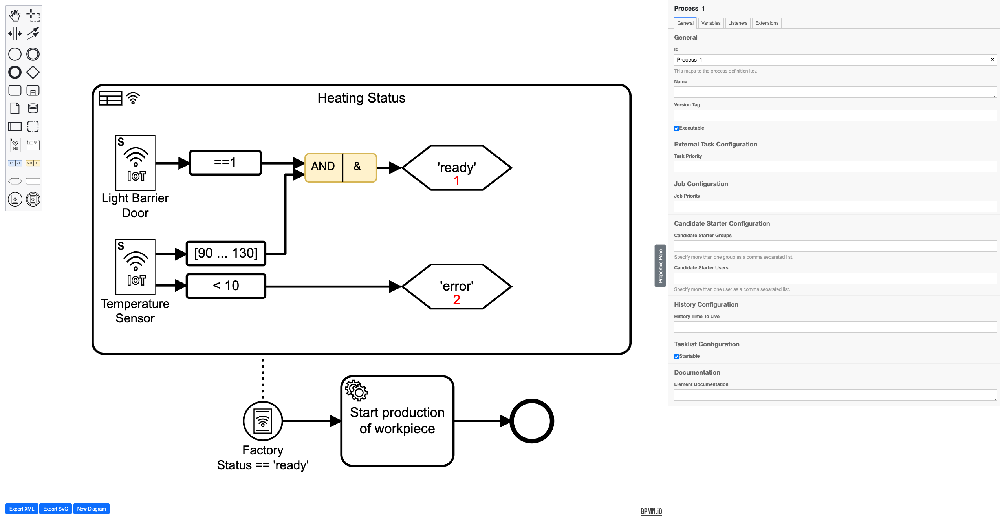

# IoT Event Modeler

## About
This project creates a BPMN 2.0 modeler supporting *IoT-driven Events* based on bpmn.io.



You can find out more about the IoT event modeler in the following publication:

Integrating IoT-Driven Events into Business Processes<br>
Yusuf Kirikkayis, Florian Gallik, Ronny Seiger, and Manfred Reichert<br>
In: Intelligent Information Systems, CAiSE Forum 2023, Zaragoza, Spain, June 12–16, 2023<br>
https://link.springer.com/chapter/10.1007/978-3-031-34674-3_11


## Run the Modeler

You need a [NodeJS](http://nodejs.org) development stack with [npm](https://npmjs.org) installed to build the project.

To install all project dependencies execute

```sh
npm install
```

To start the example execute

```sh
npm start
```
> Modeler is now accessible on **127.0.0.1:5555**

[Optional] To build the example into the `public` folder execute

```sh
npm run all
```


## License

MIT
